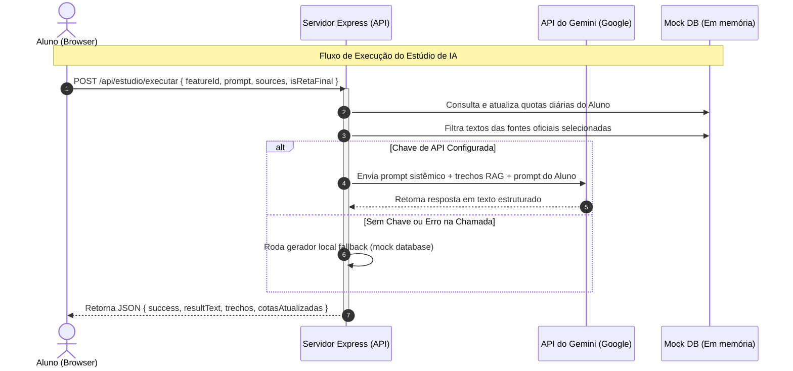

# Diagnóstico Geral de Qualidade e Arquitetura - JPSchool AI Studios

**Autor:** Antigravity (AI Coding Assistant)  
**Data:** 01 de Agosto de 2026

Este documento apresenta uma análise técnica profunda do repositório **JPSchool-IAStudios**, abrangendo a explicação completa da arquitetura, do banco de dados, dos fluxos de dados, das entradas do usuário e um diagnóstico detalhado dos problemas encontrados (bugs de lógica, botões inacessíveis e problemas visuais/layout).

---

## 1. Explicação da Arquitetura do Sistema

A aplicação adota um modelo de **repositório único (monorepo)** contendo tanto o frontend quanto o backend em uma única estrutura executada localmente de forma integrada.

### Componentes de Software:
1.  **Frontend (Interface do Usuário):**
    *   Desenvolvido em **React 19** e estruturado com **TypeScript**.
    *   **Vite 6** é utilizado como bundler, oferecendo carregamento rápido e HMR (Hot Module Replacement).
    *   Estilização baseada em **Tailwind CSS v4** para layouts modernos e responsivos.
    *   Ícones renderizados via biblioteca **Lucide React** e animações dinâmicas gerenciadas pelo pacote **Motion**.

2.  **Backend (Servidor de APIs e Estúdio de IA):**
    *   Escrito em **Express (Node.js)** com suporte a TypeScript (`tsx` para execução direta).
    *   O servidor Express atua de duas maneiras:
        *   **Em desenvolvimento:** Instancia o Vite como middleware (`vite.middlewares`) no mesmo processo e porta, permitindo servir a SPA React diretamente.
        *   **Em produção:** Serve os arquivos compilados estaticamente da pasta `dist/` e encaminha todas as rotas não resolvidas para o `index.html` (comportamento padrão de Single Page Applications).
    *   Contém a integração direta com os modelos do **Google Gemini** usando o SDK `@google/genai`. Se a chave de API (`GEMINI_API_KEY`) não estiver configurada no ambiente, o sistema chaveia automaticamente para um gerador sintético de respostas locais (fallback inteligente).

---

## 2. Modelagem do Banco de Dados (Database)

A aplicação não utiliza um banco de dados relacional (como PostgreSQL/MySQL) ou NoSQL (como MongoDB) externo. Em vez disso, todo o estado persistente do sistema é simulado em memória em um banco de dados mockado localizado em `src/data/mockDatabase.ts`.

### Coleções Simuladas:
*   `TEST_USERS`: Usuários cadastrados para testes com diferentes privilégios e papéis (`super_admin`, `admin`, `ti`, `cliente`).
*   `MOCK_MATRICULAS`: Registro de cursos ativos associados aos IDs dos usuários.
*   `MOCK_PAGAMENTOS`: Transações financeiras com valor, parcelas, método de pagamento (ex: Pix) e status de aprovação.
*   `MOCK_CODIGOS_ACESSO`: Cupons de acesso temporário (trial/cortesia) que podem ser resgatados por usuários.
*   `MOCK_TICKETS`: Chamados de suporte contendo o histórico de mensagens trocadas com o time de atendimento.
*   `MOCK_LOGS_AUDITORIA`: Registro de auditoria que rastreia ações críticas no sistema (como logins e inicializações).
*   `MOCK_CONFIGURACOES`: Tabela chave-valor de preferências globais do sistema (ex: dias restantes até a prova, regras de tamanho de senha).
*   `MOCK_LEADS`: Dados coletados de possíveis clientes interessados que preencheram formulários na página de vendas.
*   `MOCK_CAMPANHAS_COTA`: Campanhas ativas que sobrescrevem os limites padrão de produção/download de IA.
*   `OFFICIAL_SOURCES`: Lista de referências oficiais disponíveis na biblioteca do aluno (ex: editais, LDB, leis estaduais) que alimentam o contexto de RAG da IA.
*   `MOCK_QUESTIONS`: Questões reais e inéditas simulando a banca examinadora (FEPESE/ACAFE).
*   `MOCK_ANNOTATIONS`: Anotações criadas pelos alunos ao salvar os resultados gerados pelo estúdio de IA.

---

## 3. Fluxos de Dados e Entradas de Usuário

O sistema opera principalmente sob três fluxos fundamentais:



### A. Fluxo de Autenticação (Login)
1.  **Entrada:** O usuário digita suas credenciais de acesso no formulário de login (`Navbar.tsx`).
2.  **Trajeto:** Uma requisição POST é disparada para `/api/auth/login`.
3.  **Processamento:**
    *   O servidor verifica se o usuário está temporariamente bloqueado (bloqueio automático de 15 minutos se houver mais de 5 tentativas consecutivas falhas).
    *   As credenciais são validadas contra a lista `TEST_USERS`.
    *   Em caso de sucesso, o histórico de tentativas falhas é resetado e um registro de auditoria é inserido em `MOCK_LOGS_AUDITORIA`.
4.  **Retorno:** O servidor retorna `success: true` acompanhado dos dados do usuário, atualizando o estado do React para carregar a visão correspondente (plataforma ou backstage admin).

### B. Fluxo de Execução do Estúdio de IA (Tutor de IA com RAG)
1.  **Entrada:** O aluno seleciona as fontes de estudo (Left Sidebar), escolhe uma funcionalidade (Right Sidebar), digita uma dúvida ou anexa arquivos (vídeo, áudio, imagem) e clica em **"Gerar"**.
2.  **Trajeto:** Uma chamada POST contendo o ID do recurso, o prompt do usuário, a lista de IDs das fontes selecionadas e o indicador de reta final é enviada para `/api/estudio/executar`.
3.  **Processamento:**
    *   O backend verifica as cotas diárias de execução do aluno (máximo 5 produções diárias).
    *   Constrói-se o resumo textual das fontes oficiais marcadas.
    *   O backend analisa o prompt em busca de palavras-chave externas (ex: "são paulo", "federal") para saber se deve autorizar fallback/busca externa.
    *   Tenta chamar a API da Gemini. Caso ocorra erro ou a chave esteja ausente, o backend gera um texto simulado pré-construído específico para a funcionalidade correspondente.
4.  **Retorno:** Retorna o objeto contendo o texto gerado, as cotas atualizadas do aluno e os metadados de trechos oficiais/externos citados.

### C. Fluxo de Controle de Downloads (Cotas)
1.  **Entrada:** O usuário clica no botão "Baixar (Consome Cota)" na visualização de um resultado gerado.
2.  **Trajeto:** Dispara requisição POST para `/api/cotas/download`.
3.  **Processamento:** O backend incrementa em memória a contagem de downloads usados (limite de 5 por dia). Se o limite for estourado, retorna um erro `429`.
4.  **Retorno:** Retorna o status de sucesso e o objeto de cotas atualizado para sincronização de tela.

---

## 4. Relatório de Teste e Diagnóstico de Bugs

Durante os testes interativos e a análise estática do código-fonte, foram encontrados diversos problemas críticos que impactam diretamente a lógica e a usabilidade do sistema:

### A. Lógica Errada (Wrong Logic)

1.  **Modelo de IA Inválido no Backend:**
    *   **Arquivo:** [server.ts](file:///C:/Users/Jean/.gemini/antigravity-ide/scratch/JPSchool-IAStudios/server.ts#L149)
    *   **Problema:** A linha 149 declara o modelo `gemini-3.6-flash`. Este modelo não existe nas APIs oficiais da Google. Consequentemente, qualquer tentativa de executar a IA com uma API Key válida irá falhar, forçando o sistema a recorrer ao fallback sintético local em todas as requisições.
    *   **Correção recomendada:** Alterar a string do modelo para um modelo válido, como `gemini-2.5-flash`.

2.  **Erro de Indexação do Usuário Padrão (Default User Mismatch):**
    *   **Arquivos:** [App.tsx](file:///C:/Users/Jean/.gemini/antigravity-ide/scratch/JPSchool-IAStudios/src/App.tsx#L33) & [mockDatabase.ts](file:///C:/Users/Jean/.gemini/antigravity-ide/scratch/JPSchool-IAStudios/src/data/mockDatabase.ts#L264)
    *   **Problema:** O código aponta para o índice `TEST_USERS[2]` com um comentário informando tratar-se do "Cliente (jeanrsl)". No entanto, `TEST_USERS[2]` é o usuário **Admin TI** (`adminti`). O usuário cliente de teste (`jeanrsl`) está posicionado no índice `3`. Como resultado, a plataforma inicia erroneamente com a conta de TI por padrão.
    *   **Correção recomendada:** Alterar a atribuição padrão do array para `TEST_USERS[3]`.

3.  **Checkout com Login Incorreto:**
    *   **Arquivo:** [App.tsx](file:///C:/Users/Jean/.gemini/antigravity-ide/scratch/JPSchool-IAStudios/src/App.tsx#L282)
    *   **Problema:** Ao realizar a finalização de compra ("Avançar para Checkout") na gaveta do carrinho, o callback chama `handleLoginWithUser(TEST_USERS[2])`. Novamente, isso loga o usuário incorretamente como Admin TI em vez do cliente final (`TEST_USERS[3]`).
    *   **Correção recomendada:** Atualizar o parâmetro de checkout para `TEST_USERS[3]`.

4.  **Short-Circuit de Entrada de Mídia no Prompt:**
    *   **Arquivo:** [Workspace.tsx](file:///C:/Users/Jean/.gemini/antigravity-ide/scratch/JPSchool-IAStudios/src/components/LearnerPlatform/Workspace.tsx#L91)
    *   **Problema:** A linha 91 constrói o prompt utilizando operadores lógicos `||`:
        ```typescript
        const promptToUse = userPrompt || (uploadedImageName ? `[Análise da Imagem Anexada: ${uploadedImageName}] ${userPrompt}` : '') || (videoUrlInput ? `[URL da Aula: ${videoUrlInput}]` : '');
        ```
        Se o usuário preencher o campo de texto (`userPrompt`), a expressão avalia o primeiro termo como verdadeiro e encerra o fluxo (`short-circuit`), ignorando por completo qualquer imagem anexada ou URL de vídeo fornecida pelo aluno.
    *   **Correção recomendada:** Construir o prompt de forma cumulativa com condicionais normais (`if`).

5.  **Avanço Estagnado de Flashcards:**
    *   **Arquivo:** [Workspace.tsx](file:///C:/Users/Jean/.gemini/antigravity-ide/scratch/JPSchool-IAStudios/src/components/LearnerPlatform/Workspace.tsx#L529-L541)
    *   **Problema:** O painel de flashcards exibe o texto "Cartão 1 de 3". Entretanto, ao clicar nos botões "Já Memorizei" ou "Preciso Revisar", o estado da variável `cardIndex` nunca é incrementado. O aluno permanece no primeiro cartão infinitamente.
    *   **Correção recomendada:** Implementar o incremento de `cardIndex` e verificar os limites do array antes de redefinir o estado.

6.  **Conteúdo Estático nos Slides:**
    *   **Arquivo:** [Workspace.tsx](file:///C:/Users/Jean/.gemini/antigravity-ide/scratch/JPSchool-IAStudios/src/components/LearnerPlatform/Workspace.tsx#L618-L627)
    *   **Problema:** O deck de slides altera dinamicamente o título principal com base no índice ativo, mas a lista de tópicos (`ul`) interna está codificada de forma estática com os mesmos dois marcadores (Artigo 13 da LDB). Todos os slides exibem a mesma informação no corpo.
    *   **Correção recomendada:** Mapear os bullet points para uma estrutura de dados de slides que varie conforme o índice selecionado.

---

### B. Botões Falhos / Inacessíveis (Broken Elements)

1.  **Impossibilidade de Acessar a Gaveta de Anotações (Notes Drawer):**
    *   **Arquivo:** [App.tsx](file:///C:/Users/Jean/.gemini/antigravity-ide/scratch/JPSchool-IAStudios/src/App.tsx#L76)
    *   **Problema:** O componente `NotesDrawer` está devidamente declarado e recebe o estado `isOpen={isNotesOpen}`, porém a função que atualiza este estado para `true` (`setIsNotesOpen`) não é disparada por nenhum elemento visual do sistema. Não há um botão "Minhas Anotações" ou aba disponível na plataforma para o aluno abrir seu bloco de notas.
    *   **Correção recomendada:** Adicionar um atalho de botão no topo do `Navbar` ou na barra de ferramentas para ativar o estado e exibir as anotações salvas.

2.  **Ausência de Botão de Retorno no Backstage Admin:**
    *   **Arquivo:** [AdminBackstage.tsx](file:///C:/Users/Jean/.gemini/antigravity-ide/scratch/JPSchool-IAStudios/src/components/Admin/AdminBackstage.tsx)
    *   **Problema:** O painel de gestão de conteúdos (Backstage) recebe a propriedade `onGoToPlatform` via propriedades para permitir que o administrador retorne à plataforma de estudos, mas este callback nunca é mapeado a nenhum elemento ou botão no layout do componente. O administrador fica "preso" na página administrativa e é forçado a deslogar para sair dali.
    *   **Correção recomendada:** Criar um botão "Área do Aluno" ou "Voltar" no cabeçalho do backstage que execute o callback.

---

### C. Elementos e Áreas Sobrepostas (Visual Overlaps)

1.  **Gargalo de Altura Fixa com Barra de Rolagem Dupla (Double Scrollbars):**
    *   **Arquivos:** [SourcesSidebar.tsx](file:///C:/Users/Jean/.gemini/antigravity-ide/scratch/JPSchool-IAStudios/src/components/LearnerPlatform/SourcesSidebar.tsx#L143) & [StudioSidebar.tsx](file:///C:/Users/Jean/.gemini/antigravity-ide/scratch/JPSchool-IAStudios/src/components/LearnerPlatform/StudioSidebar.tsx#L100)
    *   **Problema:** O contêiner de materiais de estudo tem altura fixada estaticamente em `max-h-[460px]` e a barra lateral do estúdio em `max-h-[800px]`, ambas com `overflow-y-auto`. Se a janela de exibição for menor (telas pequenas de laptops ou tablets), estas áreas colidem verticalmente e criam rolagens aninhadas, prejudicando o scroll nativo da página.
    *   **Correção recomendada:** Substituir as classes de altura fixas por classes dinâmicas flexíveis (`flex-1 h-full`) e gerenciar o overflow apenas no contêiner pai principal.

2.  **Risco de quebra de cálculo no Carrinho (Cart Total Fallback):**
    *   **Arquivo:** [CartDrawer.tsx](file:///C:/Users/Jean/.gemini/antigravity-ide/scratch/JPSchool-IAStudios/src/components/CartDrawer.tsx#L100)
    *   **Problema:** O cálculo do total do carrinho tenta realizar um parse numérico no valor em string (`selectedPlan.price.replace(',', '.')`). Se o administrador cadastrar um preço contendo letras (como "Sob Consulta" ou "Grátis") ou incluir prefixos de moeda como "R$", a função retorna `NaN`, quebrando a exibição do preço final do carrinho.
    *   **Correção recomendada:** Limpar a string extraindo apenas dígitos e pontuação antes de tentar realizar o parse aritmético do valor.
